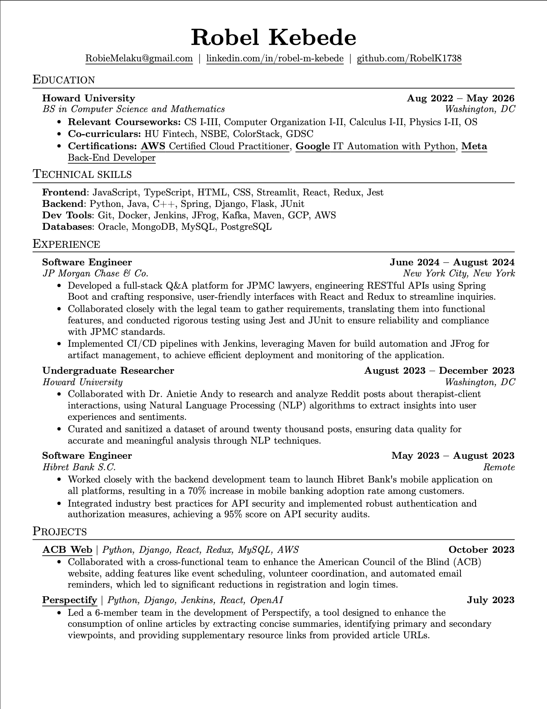

### Hi There! My name is Robel.
-----
# About Me
My name is Robel Kebede and I am a Computer Science student!

```python
class Robel:
  age = 21
  hobbies = ["Soccer⚽️", "Exercising🏋🏽‍♂️", "Video games🎮"
}
```
-----

# Certifications

### I have the following certifications:

- [](https://www.credly.com/badges/6acf04b2-2a62-4a85-a331-1aaf2d7b7e83) **AWS Certified Cloud Practitioner**
- [](https://www.coursera.org/account/accomplishments/specialization/certificate/EJ3QBE35UXYU) **Google IT Automation with Python**
- []([https://www.coursera.org/professional-certificates/meta-back-end-developer](https://www.coursera.org/account/accomplishments/specialization/certificate/QNR26LZ85BU8)) **Meta Back-End Developer**

-----

# Experience
-  **SWE Intern '24**
-  **Google Tech Exchange '24**
-  **Undergraduate Research** 

-----

# Tech Stack
[](https://skillicons.dev)

[](https://skillicons.dev)

[](https://skillicons.dev)

[](https://skillicons.dev)

-----

# Resume

### You can also view or download the full resume by clicking the image below:

[](./Robel-Kebede-Resume.pdf)


-----


